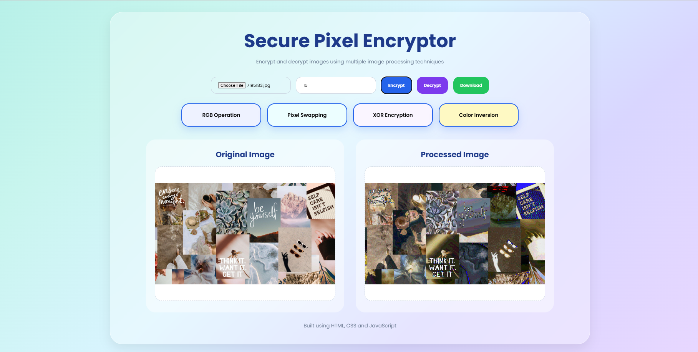

# 🔐 Secure Pixel Encryptor

Secure Pixel Encryptor is a simple web-based image encryption project developed using HTML, CSS, and JavaScript.

This project allows users to apply different image encryption techniques such as RGB manipulation, XOR encryption, pixel swapping, and color inversion to encrypt and decrypt images.

---

## ✨ Features

- Upload image functionality
- Multiple encryption techniques
- Encrypt and decrypt images
- Download processed image
- Responsive user interface
- Modern glassmorphism design
- Interactive technique cards

---

## 🛠️ Technologies Used

- HTML5
- CSS3
- JavaScript
- Canvas API

---

## 📸 Project Preview



---

## 📂 Project Structure

```bash
image_encryption_tool/
│
├── index.html
├── style.css
├── script.js
├── README.md
│
├── assets/
│   └── preview.png
```

---

## 🚀 How to Run

1. Download or clone this repository
2. Open the project folder
3. Run `index.html` in your browser

---

## 📚 Learning Experience

While developing this project, I learned:

- Basics of image encryption
- Pixel manipulation techniques
- Working with Canvas API
- JavaScript DOM manipulation
- Responsive UI design
- Frontend project structuring

This project helped me improve both my technical skills and frontend designing skills.

---

## 🎯 Future Improvements

- Add more encryption techniques
- Add drag and drop upload
- Improve animations and UI
- Add password-based encryption

---

## 👩‍💻 Author

Meghana Mogudala

SkillCraft Technology Internship Project
